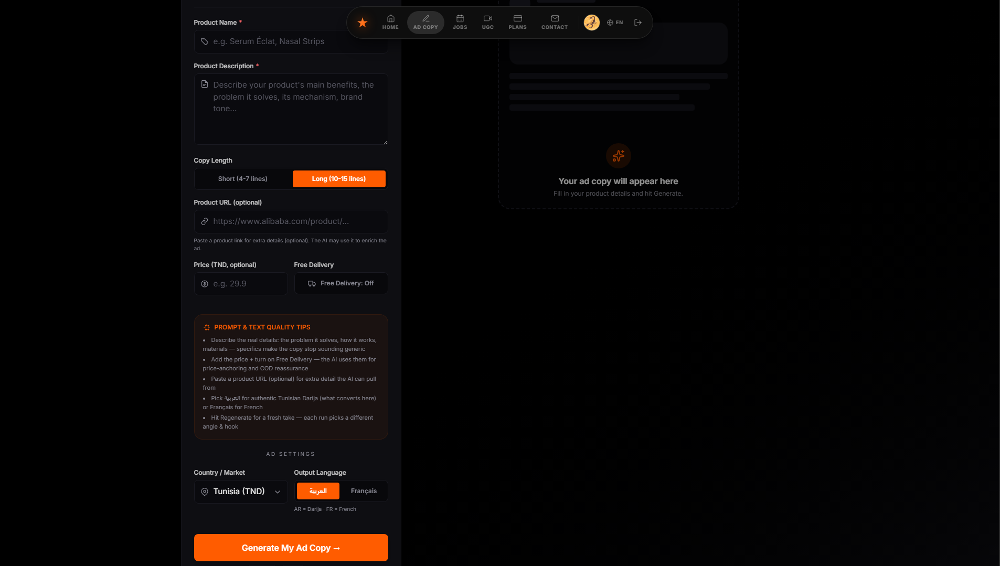
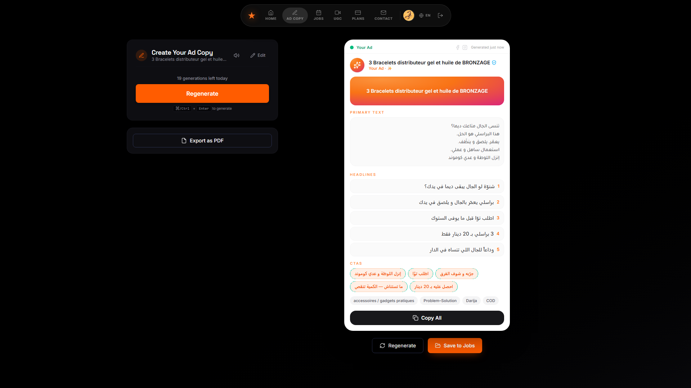
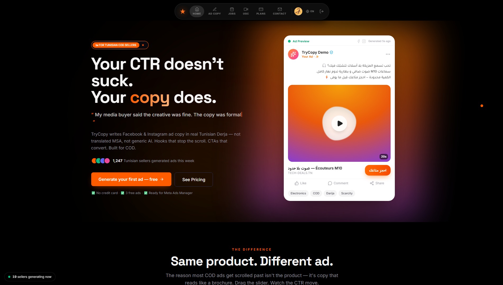

# TryCopy

**AI-powered ad copy generation for Tunisian COD e-commerce sellers.**

TryCopy generates authentic, conversion-focused ad copy in real Tunisian Darija — not the stiff, translated Arabic that generic AI tools produce. Built for COD (cash-on-delivery) sellers who need to write scroll-stopping ads fast.

> 👉 **[Try it live](your-app-url-here)**

*Source code is private — TryCopy is a commercial product. This repo is an overview of what it does and how it's built.*

---

## The problem

Tunisian COD sellers live and die by their ad copy. But writing it is painful:

- Generic AI tools (ChatGPT, etc.) write formal Modern Standard Arabic or awkward translations — they don't *speak Darija*, so the copy feels foreign and converts badly.
- Hiring a copywriter is slow and expensive.
- Most sellers end up rewriting the same ads by hand, ad after ad, product after product.

The copy that actually sells in Tunisia sounds like a person talking — local, casual, punchy. That's exactly what off-the-shelf tools can't do.

## What TryCopy does

- 🗣️ **Authentic Darija ad copy** — hooks, body, and CTAs that sound native, tuned for COD products and Tunisian buyers.
- 🎨 **AI ad visuals with Arabic text overlay** — generates product images with clean, correctly-rendered Arabic text baked in (a hybrid image-gen + HTML/CSS rendering pipeline, since most image models butcher Arabic script).
- 💳 **Prepaid credit packs** — pay-as-you-go credits built around local payment infrastructure (Flouci-compatible one-time payments), no subscription required.
- ⚡ **Built for speed** — go from product to ready-to-post ad in seconds.

## Screenshots

## Tech stack

**Frontend:** React · TypeScript · TanStack
**Backend:** FastAPI (Python)
**Database & Auth:** Supabase · PostgreSQL
**AI:** Claude API (copy generation) · hybrid image generation with HTML/CSS Arabic text rendering
**Payments:** Prepaid credits (Flouci-compatible)

## How it works (high level)

1. The seller enters their product and a few details.
2. The backend runs a tuned generation pipeline through the Claude API to produce Darija copy calibrated for COD selling.
3. For visuals, an image is generated and Arabic text is rendered cleanly over it via an HTML/CSS overlay step.
4. Each generation draws from the user's prepaid credit balance.

## About

Designed and built solo by **Amen Allah Ifaoui** — full-stack developer and founder, Tunis, Tunisia.

🔗 [LinkedIn](https://www.linkedin.com/in/amen-allah-ifaoui-1293223bb/?skipRedirect=true) · 🐙 [GitHub](https://github.com/amenallah-ifaoui)
